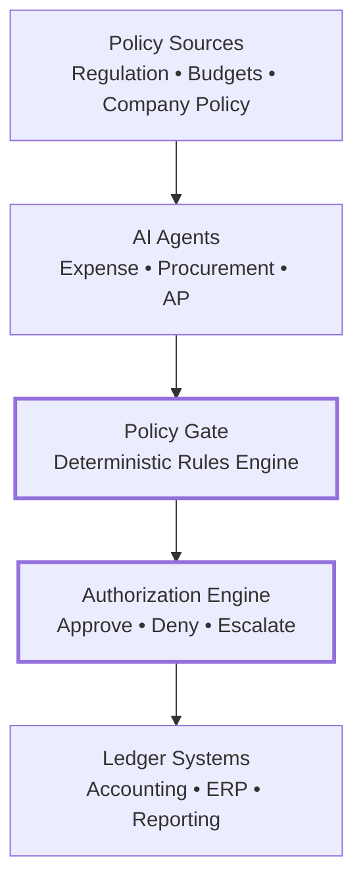
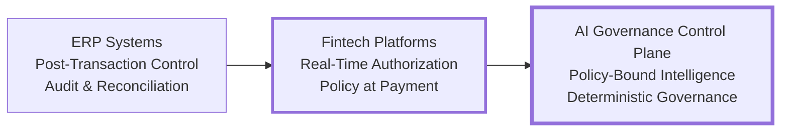
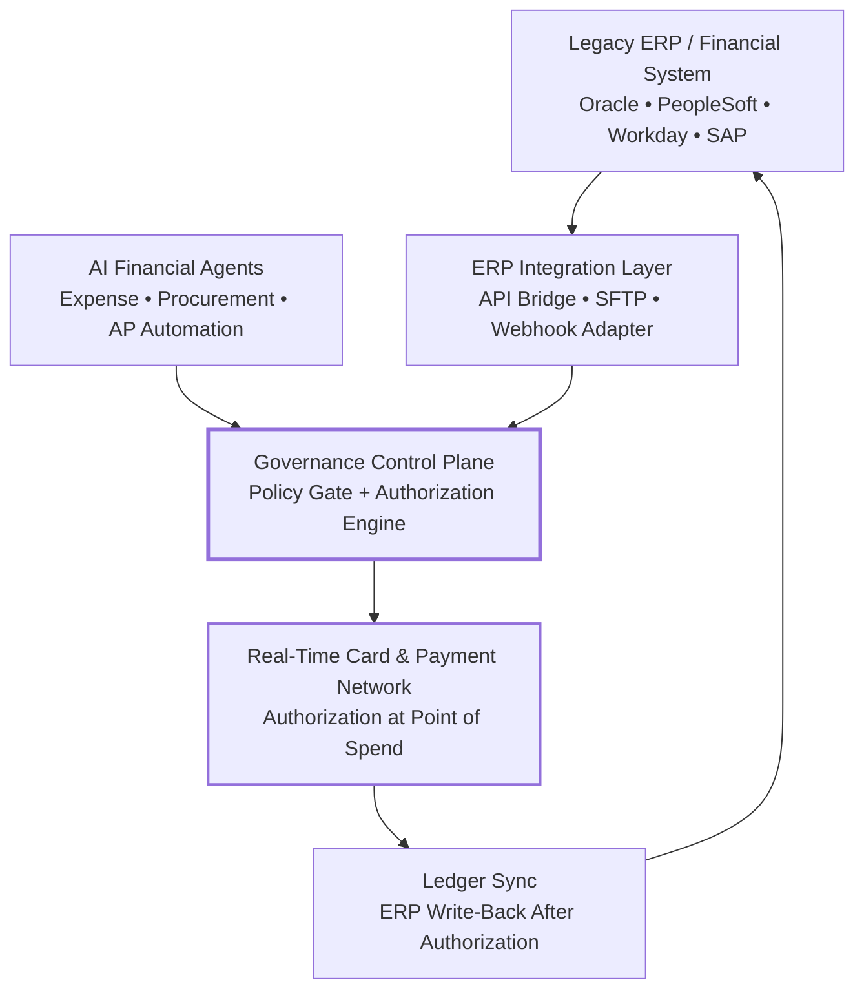

**Thesis:** Financial AI can reason probabilistically, but the movement of money must always be governed by deterministic authorization systems.

  
  


### Fintech Systems Architecture Exploration

**Why this matters now**

Financial systems are undergoing a structural shift. Traditional ERP platforms enforce policy **after transactions occur** through reconciliation and audit. Modern fintech infrastructure instead moves financial control into **real‑time authorization**, where transactions are approved or blocked before money moves.

As AI systems begin participating in financial workflows (expenses, procurement, payments), a new architectural question emerges: how can probabilistic AI reasoning operate safely inside deterministic financial control systems?

This repository explores architectural patterns that resolve that tension.

> **Problem Statement**
>
> Modern financial systems increasingly operate in **real‑time authorization environments** where policy decisions must occur _before_ money moves.
>
> At the same time, AI systems introduce **probabilistic reasoning** into workflows that historically required **deterministic compliance and auditability**.
>
> The central architectural challenge explored in this repository:
>
> _How can probabilistic AI systems safely operate inside deterministic financial control environments?_

_Note: This repository is an architecture exploration and research prototype examining governance patterns for AI in financial systems._

> **Core Thesis**  
> AI systems reason probabilistically.  
> Financial authorization must remain deterministic.  
> As AI begins to participate in financial workflows (expenses, procurement, payments), architectures must separate **AI reasoning** from **financial authorization** through a deterministic governance control plane.

## Governance Control Plane



This diagram illustrates the core architecture explored in this repository.

AI agents interpret financial activity and propose actions. Every proposed action must pass through a deterministic **policy gate** and **authorization engine** before a transaction can occur. Once authorized, the resulting transaction is recorded in the **ledger systems** (ERP, accounting, reporting).

A simple way to explain this to a business audience:

**AI reasons → Policy decides → Authorization executes → Ledger records.**

The governance control plane ensures that probabilistic AI reasoning can participate in financial workflows while deterministic policy systems remain the final authority over financial execution.

---

## Navigation

- [Financial Control Evolution](#financial-control-evolution)
- [Core Architecture Principle](#core-architecture-principle)
- [Example Financial Workflow](#example-financial-workflow)
- [Architecture Progression](#architecture-progression)
- [Public Sector Compliance Constraints](#public-sector-compliance-constraints)
- [ERP Integration Patterns](#erp-integration-patterns)
- [Real-World Architecture Reference](#real-world-architecture-reference)
- [Open Questions & Roadmap](#open-questions--roadmap)
- [Repository Structure](#repository-structure)
- [Full Architecture Paper](#full-architecture-paper)
- [About Ainalabs](#about-ainalabs)
- [Author](#author)
    

---

## Financial Control Evolution



This diagram illustrates the evolution of financial control architectures:

• **ERP systems** enforce policy after transactions through reconciliation and audit.

• **Fintech platforms** moved governance into transaction authorization.

• **AI governance architectures** introduce a deterministic control plane allowing intelligent systems to participate in financial workflows safely.

---

## Core Architecture Principle

This model summarizes modern financial infrastructure in four layers:

```
AI Reasons
↓
Policy Decides
↓
Authorization Executes
↓
Ledger Records
```

While simplified, this sequence captures the separation of responsibilities present in most modern financial systems.

• **AI systems interpret context and intent** (classification, anomaly detection, recommendations).

• **Policy systems determine whether an action is allowed** according to rules, budgets, or regulations.

• **Authorization systems execute the decision in real time**, allowing or blocking the movement of money.

• **Ledger systems record the resulting transaction** for accounting, reporting, and audit.

Traditional ERP systems primarily operate at the **ledger layer**, recording transactions after they occur. Modern fintech platforms introduce **real‑time authorization**, allowing policy decisions to occur before money moves.

Understanding these four layers provides a simple way to explain financial infrastructure to both technical and business audiences.

---

## Example Financial Workflow

A practical example of the architecture in action:

```
Employee attempts to purchase a SaaS subscription
        ↓
AI agent interprets the merchant and expense intent
        ↓
Policy gate evaluates budget, merchant rules, and approval requirements
        ↓
Authorization engine returns approve / deny decision
        ↓
Ledger records the approved transaction
```

This scenario demonstrates how probabilistic AI interpretation can operate safely when deterministic policy systems control final authorization.

---

## Architecture Progression

This progression illustrates how financial AI systems evolve from **task automation** to **governed financial infrastructure**.

The repository explores a staged evolution of financial AI systems.

```
V1  AI Expense Agent
    ↓
V2  Embedded Policy Enforcement
    ↓
V3  Policy Gate Architecture
    ↓
V4  Real‑Time Spend Authorization
    ↓
V5  AI Governance Control Plane
```

**V1 - AI Expense Agent**  
AI interprets receipts and drafts expense records.

**V2 - Embedded Policy Enforcement**  
Policy rules embedded directly in AI agents.

**V3 - Policy Gate Architecture**  
Deterministic policy validation separated from AI reasoning.

**V4 - Real‑Time Spend Authorization**  
Policy engines operate at transaction authorization.

**V5 - AI Governance Control Plane**  
Centralized governance layer managing multiple AI financial agents.

---

## Real-World Architecture Reference

This repository is an abstract architecture exploration, but the model it describes maps directly onto how modern fintech infrastructure is built in production.

The Generation 2 shift - moving financial control from post-transaction reconciliation into the real-time authorization layer - is not theoretical. A class of modern spend management platforms has already made this transition. Rather than recording transactions after the fact as traditional ERP systems do, these platforms enforce spend policy at the moment of the transaction, before money moves. Budget enforcement, merchant controls, and approval workflows operate at authorization time, not in the next reconciliation cycle.

In the terms of this repository, a representative Generation 2 platform looks like this:

| Architecture Layer | Production Implementation |
|-------------------|--------------------------|
| Real-time authorization | Card network authorization with policy enforcement at point of spend |
| Policy compilation | Spend policies, budget limits, and merchant controls configured in platform |
| ERP integration | Native integrations with NetSuite, QuickBooks, Sage, Xero - ledger write-back after authorization |
| Audit trail | Transaction-level audit log with policy context, available for compliance review |
| AI participation | Receipt matching, expense categorization, and anomaly detection |

Where this maps on the V1→V5 progression: leading spend management platforms today operate solidly at **V4** (real-time spend authorization), with AI features across the classification layer. The **V5 governance control plane** - a centralized, independently auditable policy gate managing multiple AI agents across spend categories - represents the natural architectural extension as AI participation in financial workflows deepens into regulated enterprise and public sector environments.

The architectural question this repository explores is therefore not hypothetical. It is the problem the industry is actively solving.

---

## Open Questions & Roadmap

The architecture described here is a working model, not a finished one. The following questions are actively unresolved and represent directions for further exploration.

**Policy conflict resolution**
When two compliance frameworks produce conflicting authorization rules (e.g., HIPAA mandates additional review; spend policy auto-approves under a dollar threshold), which takes precedence and how is the resolution mechanism governed?

**AI classification failure modes**
What happens when the AI is wrong with high confidence? How does the system behave when escalation paths are unavailable (off-hours, holiday)? What is the default policy gate behavior for novel transaction types with no strong classification signal?

**Latency vs. compliance trade-offs**
Some compliance checks (vendor registry lookups, budget commitment validation) may require external calls that exceed the real-time authorization window. What is the right architecture for checks that cannot complete in under 100ms?

**Multi-entity policy governance**
Public sector deployments frequently span organizational hierarchies - federal agencies with sub-agencies, state systems with municipal subdivisions. How should policy inheritance and override work across these structures?

**Policy compiler auditability**
If AI assists in compiling policy rules from regulatory documents, the compiler itself introduces probabilistic behavior upstream of the deterministic gate. Does the governance model need to extend to cover policy compilation, not just policy evaluation?

See [RESEARCH.md](./RESEARCH.md) for the full working notes on these questions.

---

## Repository Structure

A simple structure that reflects both the **architecture exploration** and the **evolution of the system**:

```
/architecture
   control_plane_diagram.md
   financial_control_evolution.md

/scenarios
   expense_workflow_example.md
   procurement_policy_example.md

/evolution
   v1_expense_agent.md
   v2_embedded_policy.md
   v3_policy_gate.md
   v4_real_time_authorization.md
   v5_governance_control_plane.md

/src
   policy_gate.py          # Deterministic policy gate prototype (Python)

/docs
   ai-financial-governance-architecture.md

RESEARCH.md               # Open questions and ongoing exploration notes
```

---

## Public Sector Compliance Constraints

Public sector financial systems operate under compliance frameworks that make the **deterministic authorization requirement** even more critical than in commercial environments. AI governance architectures must account for these constraints from the design stage.

| Framework | Scope | Authorization Implication |
|-----------|-------|--------------------------|
| **FedRAMP** | Federal cloud services | Authorization decisions must be logged, auditable, and traceable to specific policy rules |
| **FISMA** | Federal information systems | Risk-based control of financial data access; continuous monitoring of authorization events |
| **CJIS** | Criminal justice / law enforcement | Strict access controls; no probabilistic decisions on data access - deterministic only |
| **HIPAA** | Healthcare / HHS agencies | Financial transactions involving protected health information require audit trails at the authorization layer |
| **SOC 2 Type II** | State and local SaaS procurement | Authorization logic must be documented, testable, and independently verified |

### How the Governance Control Plane Addresses These Requirements

```
Compliance Requirement          → Governance Control Plane Response
────────────────────────────    ────────────────────────────────────────────────
Audit traceability              → Every AI-proposed action logged before policy gate evaluation
Deterministic enforcement       → Policy gate uses rules engine, not AI inference
Role-based access control       → Authorization engine enforces entitlements independently of AI layer
Immutable transaction records   → Ledger write occurs only after authorization approval
Continuous monitoring           → Policy gate emits structured events for SIEM / compliance systems
```

Public sector procurement increasingly requires vendors to demonstrate not just that their platform is compliant, but that **compliance is enforced at the architectural level** - before transactions occur, not after. This is precisely the problem the governance control plane is designed to solve.

---

## ERP Integration Patterns

Modern public sector agencies commonly operate on legacy ERP platforms (Oracle, PeopleSoft, Workday, SAP) that enforce financial policy **after transactions** through reconciliation and reporting. Integrating a real-time authorization layer with these systems requires careful architectural separation.

### Integration Architecture



### Key Integration Patterns

**Pattern 1 - Authorization Before ERP Commitment**
The governance control plane authorizes or denies transactions in real time. Only approved transactions are written back to the ERP ledger. The ERP system receives a clean, pre-validated transaction record rather than raw spend data requiring reconciliation.

**Pattern 2 - Policy Sync from ERP to Control Plane**
Budget data, approval hierarchies, and vendor lists are pulled from the ERP on a defined schedule and compiled into the policy gate's rules engine. The ERP remains the system of record for policy; the control plane enforces it in real time.

**Pattern 3 - Dual Audit Trail**
Authorization events are logged in the control plane with full metadata (AI classification, policy rule applied, decision outcome, timestamp). The ERP receives a summarized transaction record. Both logs are available for compliance audit - the control plane log provides the authorization chain of custody.

### Python Prototype: Policy Gate Evaluation

A simplified example of how a policy gate evaluates an AI-proposed financial action before authorization:

```python
from dataclasses import dataclass
from enum import Enum

class Decision(Enum):
    APPROVE = "approve"
    DENY = "deny"
    ESCALATE = "escalate"

@dataclass
class SpendRequest:
    employee_id: str
    merchant_category: str
    amount: float
    budget_code: str

@dataclass
class PolicyContext:
    available_budget: float
    approved_merchant_categories: list[str]
    single_transaction_limit: float
    requires_approval_above: float

def evaluate_policy_gate(request: SpendRequest, policy: PolicyContext) -> tuple[Decision, str]:
    """
    Deterministic policy gate: evaluates AI-proposed spend action against policy rules.
    Returns a Decision and audit-ready reason string.
    AI reasoning occurs upstream. This function contains no probabilistic logic.
    """
    if request.merchant_category not in policy.approved_merchant_categories:
        return Decision.DENY, f"Merchant category '{request.merchant_category}' not in approved list"

    if request.amount > policy.single_transaction_limit:
        return Decision.DENY, f"Amount ${request.amount} exceeds single transaction limit ${policy.single_transaction_limit}"

    if request.amount > policy.available_budget:
        return Decision.DENY, f"Insufficient budget: requested ${request.amount}, available ${policy.available_budget}"

    if request.amount > policy.requires_approval_above:
        return Decision.ESCALATE, f"Amount ${request.amount} requires manager approval (threshold: ${policy.requires_approval_above})"

    return Decision.APPROVE, "All policy conditions satisfied"


# Example usage
request = SpendRequest(
    employee_id="emp_1042",
    merchant_category="SaaS_Subscription",
    amount=450.00,
    budget_code="DEPT_ENG_Q1"
)

policy = PolicyContext(
    available_budget=2000.00,
    approved_merchant_categories=["SaaS_Subscription", "Travel", "Office_Supplies"],
    single_transaction_limit=1000.00,
    requires_approval_above=500.00
)

decision, reason = evaluate_policy_gate(request, policy)
print(f"Decision: {decision.value}")
print(f"Reason: {reason}")
# Decision: approve
# Reason: All policy conditions satisfied
```

> This prototype illustrates the core principle: **AI classifies the transaction upstream; the policy gate applies deterministic rules to produce an auditable authorization decision.** The policy gate contains no machine learning or probabilistic logic - every decision maps directly to a traceable rule.

---

## Full Architecture Paper

The complete architectural exploration can be found here:

```
docs/ai-financial-governance-architecture.md
```

This document explains the architecture model, governance patterns, and system evolution in detail.

---

---

## Author

**Bo Aina**  
Solution Engineer

**Focus**  
AI Governance  
Financial Systems Architecture


LinkedIn: [https://linkedin.com/in/boaina](https://linkedin.com/in/boaina)  
GitHub: [https://github.com/boaina](https://github.com/boaina)

---
